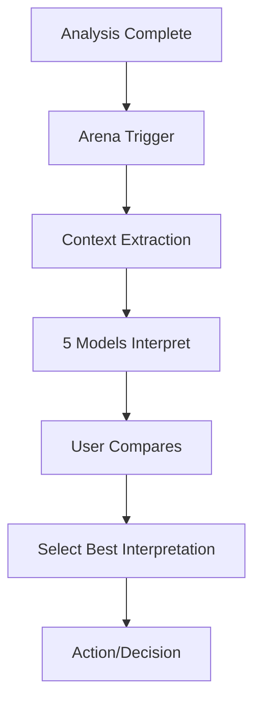

# Arena Mode Extension Proposal
## Transforming Arena from Q&A to Analysis Intelligence Layer

---

## Executive Summary

This proposal outlines how to extend ChatMRPT's Arena mode from a simple Q&A comparison tool to a sophisticated analysis interpretation layer. The enhanced Arena will enable multiple AI models to compete in interpreting analysis results, explaining visualizations, and providing actionable planning recommendations based on malaria risk data.

---

## 1. Current State Analysis

### What Arena Does Now:
- **Limited Scope**: Compares 5 models (OpenAI + 4 Ollama models) on general knowledge questions
- **Isolated Operation**: Functions independently of analysis workflows
- **Simple Comparisons**: Users vote on preferred responses to text prompts
- **No Context Awareness**: Models lack access to analysis results or visualizations

### Current Architecture:
```python
# Current flow
User Question → Arena Manager → Models → Text Responses → User Vote
```

### Limitations:
- Cannot interpret TPR analysis results
- Cannot explain generated maps or charts
- Cannot provide data-driven recommendations
- No integration with analysis pipelines

---

## 2. Proposed Enhancement Vision

### Arena as Analysis Intelligence Layer:



### Key Capabilities:
1. **Interpretation Arena**: Models compete to explain analysis results
2. **Visualization Arena**: Models explain maps, charts, and patterns
3. **Planning Arena**: Models suggest intervention strategies
4. **Validation Arena**: Models critique and validate analysis approaches

---

## 3. Integration Points

### 3.1 Post-Analysis Integration

**Trigger Point**: After `run_full_analysis_pipeline()` completes

**Context Provided**:
- Analysis summary statistics
- Top risk wards/regions
- Key indicators and their values
- Composite scores and rankings

**Arena Prompt Template**:
```python
context = {
    "analysis_type": "composite_risk_scoring",
    "total_wards": 774,
    "high_risk_wards": 156,
    "key_indicators": [
        {"name": "test_positivity_rate", "value": 70.5, "trend": "increasing"},
        {"name": "microscopy_availability", "value": 22.3, "trend": "decreasing"}
    ],
    "top_risk_areas": ["Kano Municipal", "Fagge", "Tarauni"]
}

prompt = f"""
Analysis Results Summary:
{json.dumps(context, indent=2)}

As a malaria epidemiologist, interpret these analysis results:
1. What do these findings mean for intervention planning?
2. Which areas should be prioritized and why?
3. What are the potential limitations of this analysis?
4. Recommend 3 specific actions based on these results.
"""
```

### 3.2 Post-Visualization Integration

**Trigger Point**: After map/chart generation

**Context Provided**:
- Visualization type and purpose
- Key patterns visible
- Data ranges and distributions
- Outliers and anomalies

**Arena Prompt Template**:
```python
viz_context = {
    "type": "choropleth_map",
    "metric": "TPR_by_ward",
    "color_scale": "red_gradient",
    "notable_patterns": [
        "cluster_of_high_TPR_in_north",
        "low_TPR_corridor_in_south"
    ],
    "statistics": {
        "min": 12.3,
        "max": 89.7,
        "median": 45.6,
        "std_dev": 18.2
    }
}

prompt = f"""
Visualization Analysis:
{json.dumps(viz_context, indent=2)}

Explain this TPR map to a non-technical health official:
1. What story does this map tell?
2. What spatial patterns are significant?
3. Are there any concerning clusters?
4. How should this inform resource allocation?
"""
```

### 3.3 Planning Integration

**Trigger Point**: User requests intervention planning

**Context Provided**:
- Budget constraints
- Available interventions (ITN, IRS, etc.)
- Population demographics
- Historical intervention data

**Arena Prompt Template**:
```python
planning_context = {
    "budget": "$500,000",
    "target_population": 250000,
    "available_interventions": ["ITN_distribution", "IRS_spraying", "SMC_campaigns"],
    "high_risk_wards": 45,
    "previous_coverage": {
        "ITN": 0.42,
        "IRS": 0.18
    }
}

prompt = f"""
Intervention Planning Context:
{json.dumps(planning_context, indent=2)}

Design an optimal intervention strategy:
1. How should the budget be allocated?
2. Which interventions for which areas?
3. Expected impact on malaria burden?
4. Timeline for implementation?
"""
```

---

## 4. Use Cases & Scenarios

### Scenario 1: TPR Analysis Interpretation
```
User uploads data → TPR analysis completes → Shows 70% positivity rate
↓
Arena Triggered: "5 models will now interpret these TPR results"
↓
Model A: "High TPR indicates intense transmission..."
Model B: "70% TPR suggests testing bias toward symptomatic cases..."
Model C: "This level requires immediate intervention..."
Model D: "Consider seasonal patterns in interpretation..."
Model E: "TPR alone insufficient, need incidence data..."
↓
User selects most insightful interpretation
```

### Scenario 2: ITN Distribution Map Explanation
```
ITN coverage map generated → Shows gaps in coverage
↓
Arena Triggered: "Models will explain the coverage patterns"
↓
Model A: "Urban areas show lower coverage due to..."
Model B: "The corridor effect suggests logistical challenges..."
Model C: "Priority areas based on gap analysis..."
Model D: "Historical distribution patterns indicate..."
Model E: "Cost-effectiveness suggests focusing on..."
↓
User gets multiple perspectives on distribution strategy
```

### Scenario 3: Risk Ranking Validation
```
Composite risk scores calculated → Top 10 wards identified
↓
Arena Triggered: "Models will validate the ranking methodology"
↓
Model A: "The weighting scheme appropriately captures..."
Model B: "Potential bias toward urban areas because..."
Model C: "Missing indicators that could affect rankings..."
Model D: "Statistical validity of composite scoring..."
Model E: "Alternative ranking approaches to consider..."
↓
User gains confidence in methodology or identifies improvements
```

---

## 5. Technical Architecture

### 5.1 Backend Changes

**New Arena Context Manager**:
```python
# app/core/arena_analysis_context.py

class ArenaAnalysisContext:
    def __init__(self):
        self.analysis_results = {}
        self.visualizations = {}
        self.metadata = {}
    
    def extract_analysis_context(self, pipeline_results):
        """Extract relevant context from analysis pipeline"""
        return {
            'summary_stats': self._get_summary_stats(pipeline_results),
            'key_findings': self._extract_key_findings(pipeline_results),
            'data_quality': self._assess_data_quality(pipeline_results),
            'timestamp': datetime.now().isoformat()
        }
    
    def extract_viz_context(self, viz_type, viz_data):
        """Extract context from visualization"""
        return {
            'viz_type': viz_type,
            'data_distribution': self._analyze_distribution(viz_data),
            'patterns': self._detect_patterns(viz_data),
            'anomalies': self._detect_anomalies(viz_data)
        }
    
    def build_arena_prompt(self, context_type, context_data, task):
        """Build context-aware prompt for Arena models"""
        templates = {
            'interpretation': self._interpretation_template,
            'explanation': self._explanation_template,
            'planning': self._planning_template,
            'validation': self._validation_template
        }
        return templates[task](context_type, context_data)
```

**Modified Arena Manager**:
```python
# Extend app/core/arena_manager.py

class EnhancedArenaManager(ArenaManager):
    def __init__(self):
        super().__init__()
        self.context_manager = ArenaAnalysisContext()
    
    async def create_analysis_battle(self, 
                                    analysis_results,
                                    battle_type='interpretation'):
        """Create context-aware analysis battle"""
        context = self.context_manager.extract_analysis_context(analysis_results)
        prompt = self.context_manager.build_arena_prompt(
            'analysis', context, battle_type
        )
        
        # Create battle with context-rich prompt
        battle_id = await self.create_battle(prompt)
        
        # Store context for reference
        self.store_battle_context(battle_id, context)
        
        return battle_id
```

### 5.2 Frontend Integration

**New UI Components**:
```javascript
// app/static/js/arena_analysis_integration.js

class ArenaAnalysisIntegration {
    constructor() {
        this.currentAnalysisContext = null;
        this.setupTriggers();
    }
    
    setupTriggers() {
        // Listen for analysis completion
        document.addEventListener('analysisComplete', (event) => {
            this.showArenaOption(event.detail);
        });
        
        // Listen for visualization generation
        document.addEventListener('vizGenerated', (event) => {
            this.showVizArenaOption(event.detail);
        });
    }
    
    showArenaOption(analysisResults) {
        const arenaButton = this.createArenaButton(
            'Get AI Interpretations',
            () => this.launchInterpretationArena(analysisResults)
        );
        this.insertAfterResults(arenaButton);
    }
    
    async launchInterpretationArena(results) {
        const response = await fetch('/api/arena/analysis', {
            method: 'POST',
            headers: {'Content-Type': 'application/json'},
            body: JSON.stringify({
                type: 'interpretation',
                context: results
            })
        });
        
        const battle = await response.json();
        this.displayArenaComparison(battle);
    }
}
```

### 5.3 API Endpoints

**New Arena Analysis Endpoints**:
```python
# app/web/routes/arena_analysis_routes.py

@arena_bp.route('/api/arena/analysis', methods=['POST'])
async def create_analysis_arena():
    data = request.json
    arena_type = data.get('type')  # interpretation, explanation, planning
    context = data.get('context')
    
    # Create context-aware battle
    battle_id = await arena_manager.create_analysis_battle(
        context, 
        battle_type=arena_type
    )
    
    # Generate responses from all models
    responses = await arena_manager.generate_all_responses(
        battle_id,
        include_context=True
    )
    
    return jsonify({
        'battle_id': battle_id,
        'responses': responses,
        'context_provided': True
    })

@arena_bp.route('/api/arena/viz/<viz_id>/explain', methods=['POST'])
async def explain_visualization(viz_id):
    # Get visualization data
    viz_data = get_visualization_data(viz_id)
    
    # Extract context
    context = arena_manager.context_manager.extract_viz_context(
        viz_data['type'],
        viz_data['data']
    )
    
    # Create explanation battle
    battle_id = await arena_manager.create_viz_battle(context)
    
    return jsonify({'battle_id': battle_id})
```

---

## 6. Implementation Phases

### Phase 1: Foundation (Week 1-2)
- [ ] Create ArenaAnalysisContext class
- [ ] Implement context extraction methods
- [ ] Design prompt templates for different tasks
- [ ] Add context storage to Redis

### Phase 2: Analysis Integration (Week 3-4)
- [ ] Integrate with analysis pipeline completion
- [ ] Add interpretation triggers
- [ ] Create analysis battle UI components
- [ ] Test with TPR and composite scoring

### Phase 3: Visualization Integration (Week 5-6)
- [ ] Hook into visualization generation
- [ ] Implement map/chart explanation prompts
- [ ] Add visual pattern detection
- [ ] Create explanation UI flow

### Phase 4: Planning Features (Week 7-8)
- [ ] Design planning context structure
- [ ] Implement budget/resource prompts
- [ ] Add intervention recommendation logic
- [ ] Create planning comparison UI

### Phase 5: Polish & Testing (Week 9-10)
- [ ] Comprehensive testing
- [ ] Performance optimization
- [ ] Documentation
- [ ] User training materials

---

## 7. Challenges & Solutions

### Challenge 1: Context Size Limitations
**Problem**: Analysis results may be too large for model context windows
**Solution**: 
- Implement intelligent summarization
- Extract only key metrics and findings
- Use hierarchical context (summary → details on demand)

### Challenge 2: Response Quality Variation
**Problem**: Models may produce inconsistent quality interpretations
**Solution**:
- Add quality scoring metrics
- Implement response validation
- Provide interpretation guidelines in prompts

### Challenge 3: Real-time Performance
**Problem**: 5 models generating complex interpretations may be slow
**Solution**:
- Implement parallel processing
- Add progressive loading
- Cache common interpretation patterns

### Challenge 4: Domain Expertise
**Problem**: Models may lack malaria-specific knowledge
**Solution**:
- Include domain context in prompts
- Add reference ranges and thresholds
- Implement fact-checking against known epidemiological principles

---

## 8. Success Metrics

### Quantitative Metrics:
- **Adoption Rate**: % of analyses followed by Arena interpretation
- **Completion Rate**: % of started Arena sessions completed
- **Response Time**: Average time to generate 5 interpretations
- **User Preference**: Distribution of model selections

### Qualitative Metrics:
- **Interpretation Quality**: Expert review of model outputs
- **Actionability**: Users report interpretations help decision-making
- **Insight Generation**: Novel insights identified through Arena
- **User Satisfaction**: Feedback on interpretation usefulness

---

## 9. Example Implementation

### Working Example: TPR Interpretation Arena

```python
# When TPR analysis completes
def trigger_tpr_interpretation_arena(tpr_results):
    # Extract key context
    context = {
        'overall_tpr': tpr_results['overall_tpr'],
        'state_breakdown': tpr_results['by_state'][:5],  # Top 5 states
        'trend': tpr_results.get('trend', 'unknown'),
        'data_completeness': tpr_results['completeness'],
        'outliers': tpr_results.get('outliers', [])
    }
    
    # Build interpretation prompt
    prompt = f"""
    Malaria Test Positivity Rate Analysis Results:
    
    Overall TPR: {context['overall_tpr']}%
    Data Completeness: {context['data_completeness']}%
    
    Top 5 States by TPR:
    {format_state_breakdown(context['state_breakdown'])}
    
    As a malaria epidemiologist, provide:
    1. Interpretation of these TPR values
    2. What this means for malaria transmission
    3. Data quality considerations
    4. Recommended next steps for the program
    
    Keep your response concise but insightful.
    """
    
    # Launch Arena with this prompt
    battle = arena_manager.create_battle(
        prompt=prompt,
        metadata={'type': 'tpr_interpretation', 'context': context}
    )
    
    return battle
```

---

## 10. Future Enhancements

### Near-term (3-6 months):
- **Multi-modal Arena**: Include image analysis for maps
- **Collaborative Arena**: Models build on each other's interpretations
- **Specialized Models**: Fine-tuned models for malaria domain

### Long-term (6-12 months):
- **Predictive Arena**: Models compete on forecasting
- **Scenario Arena**: What-if analysis competitions
- **Research Arena**: Literature-backed interpretations
- **Training Mode**: Use Arena to train health workers

---

## 11. Conclusion

Extending Arena mode from simple Q&A to a comprehensive analysis interpretation layer will transform ChatMRPT into a more powerful decision-support tool. By enabling multiple AI models to compete in interpreting results, explaining visualizations, and suggesting interventions, we provide users with diverse perspectives and deeper insights into their malaria data.

The phased implementation approach ensures we can deliver value incrementally while maintaining system stability. The architecture is designed to be extensible, allowing for future enhancements as model capabilities and user needs evolve.

**Next Steps**:
1. Review and approve this proposal
2. Prioritize implementation phases
3. Allocate development resources
4. Begin Phase 1 implementation

---

## Appendix A: Prompt Templates

[Detailed prompt templates for each Arena type would go here]

## Appendix B: Technical Specifications

[Detailed API specifications and data schemas would go here]

## Appendix C: User Interface Mockups

[UI/UX designs for Arena integration points would go here]
