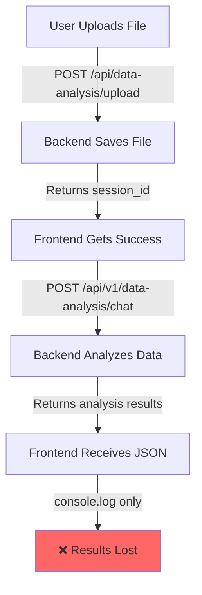
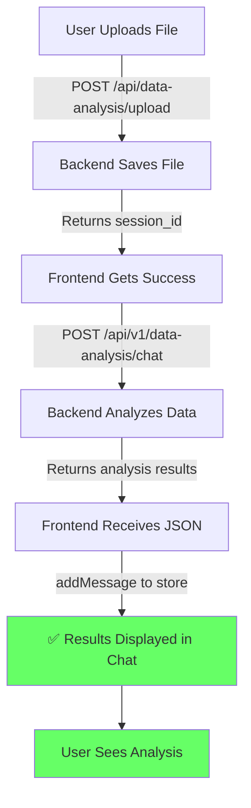

# Data Analysis Upload Flow - Visual Diagram

## Current (Broken) Flow



## Expected (Working) Flow



## The Missing Link

```
Current Implementation:
┌─────────────────┐
│  API Response   │
│   (Has Data)    │
└────────┬────────┘
         │
         ▼
┌─────────────────┐
│  console.log()  │ ← STOPS HERE
└─────────────────┘

What's Needed:
┌─────────────────┐
│  API Response   │
│   (Has Data)    │
└────────┬────────┘
         │
         ▼
┌─────────────────┐
│ Extract Message │
└────────┬────────┘
         │
         ▼
┌─────────────────┐
│  addMessage()   │
└────────┬────────┘
         │
         ▼
┌─────────────────┐
│  Display Chat   │
└─────────────────┘
```

## Code Location

**File**: `frontend/src/components/Modal/UploadModal.tsx`
**Lines**: 346-349
**Function**: Data Analysis upload handler

## Simple Fix Preview

```diff
  } else {
    const responseData = await chatResponse.json();
    console.log('Data analysis triggered successfully:', responseData);
+   
+   // Add the analysis results to chat
+   if (responseData.success && responseData.message) {
+     const analysisMessage = {
+       id: `msg_${Date.now() + 2}`,
+       type: 'regular',
+       sender: 'assistant',
+       content: responseData.message,
+       timestamp: new Date(),
+       sessionId: backendSessionId
+     };
+     addMessage(analysisMessage);
+   }
  }
```